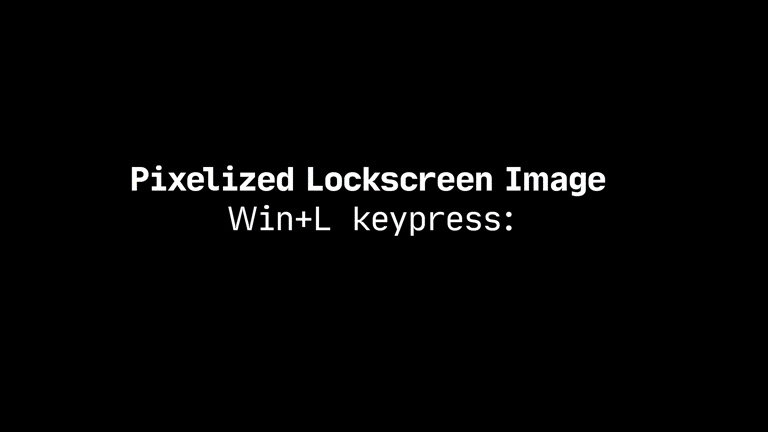

# Pixelized Lockscreen Background Image

## How It Works
When you press the Windows key, a pixelated/blurred screenshot is taken and set as your lock screen background.
The same happens after one minute of inactivity.
This helps you stay focused and maintain an unobtrusive work environment, see [Hund's recommendations](https://web.archive.org/web/20231004142509/https://hund.tty1.se/2018/09/04/use-a-pixelated-version-of-your-desktop-as-your-lockscreen-with-i3lock.html).  

## Installation
1. Download [`pixelized-lockscreen.exe`](pixelized-lockscreen.exe), a compiled version (AHKv2-64) of the script
2. Download and run [`install.cmd`](install.cmd) to run it on startup as scheduled task (`run as admin` might be required)

## Troubleshooting
On slow systems making screenshot **may take more time** than timespan between Win keydown and L keydown.  
To add more time before your PC goes into locked state, you may consider to install [postpone-win-l](/postpone-win-l) tool.  
Also, to reduce screenshot' size, set `blurSize` to greater value. Because effectively, blur size means screenshot scale, e.g. if screen resolution is 1920×1080, `blurSize=2` to produce 960×540 screenshot.  

## Customization
Download and modify [`config.json`](config.json).  

Enjoy!

