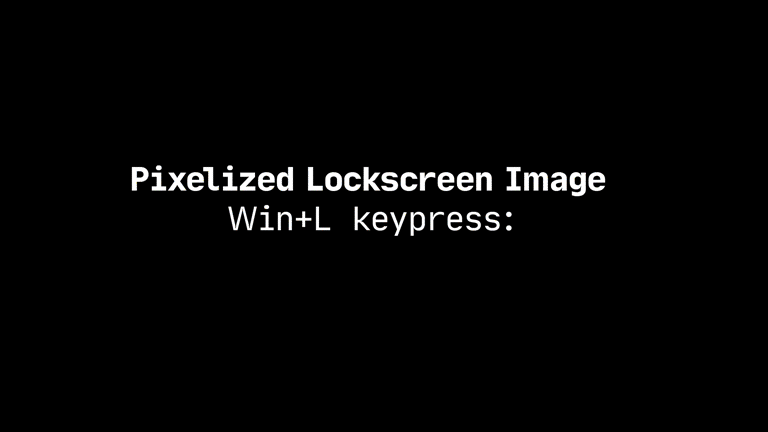

# Lockscreen with Pixelized Screenshot

## How It Works
You press `Win+L` → pixelated screenshot is taken → lock screen image is set → PC is locked.  
Helps to stay focused and maintain an unobtrusive work environment, see [Hund's recommendations](https://web.archive.org/web/20231004142509/https://hund.tty1.se/2018/09/04/use-a-pixelated-version-of-your-desktop-as-your-lockscreen-with-i3lock.html).  

Cases handled:
- manual PC lock with `Win+L`
- lock via `Start Menu` → `Power` → `Lock`
- lock after inactivity period (either via `Screen Saver` or other methods)
- lid close lock (not tested)
- paired Bluetooth device (phone) out of range (not tested)

## Installation
1. Download the [latest release](https://github.com/yakunins/windows-pixelized-lockscreen/releases/latest) and extract the zip
2. Run `install.cmd` to register as a startup scheduled task and disable native `Win+L` (`run as admin` might be required)

The installer disables the native `Win+L` shortcut via registry, so the app can handle it programmatically (screenshot, set lock screen, then lock). Running `uninstall.cmd` re-enables native Win+L and removes the scheduled task.

## Customization
Modify [`config.json`](config.json) to enable/disable locking handlers and adjust settings.

To reduce screenshot size, provide `blurSize` with a greater value. Effectively, blur size means screenshot scale, e.g. when screen resolution is 1920x1080, `blurSize=2` produces a 960x540 screenshot.  

Enjoy!  
A donut, [maybe](https://www.paypal.com/donate/?business=KXM47EKBXFV4S&no_recurring=0&item_name=funding+of+github.com%2Fyakunins&currency_code=USD)? 🍩
